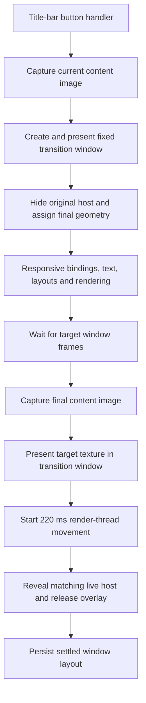

# Professional maximize/restore responsiveness analysis — 2026-10-02

The user accepts the current title/glyph rendering, smooth movement and final settlement: “that works wonderfully, and the jarring jerkiness is gone.” The remaining defect is the delay between requesting maximize/restore and movement beginning. This document proposes the next scoped work; it does not implement or publish a new animation.

The Professional maximize/restore P0 gate remains open for responsiveness and the remaining caption/multi-monitor checks. Preserve the accepted header rendering, endpoint matching, current workspace and other approved transitions. The Option 3 direction is unchanged.

## Finding in plain English

The app spends roughly a second preparing pictures of the window before it starts its 220 ms movement. The largest delays are recalculating the resized interface and getting its first new frame rendered. There is additional work capturing both endpoint images, displaying them in the transition window and waiting for submitted frames. The current visual fix succeeds because movement starts with both correct endpoint images available; making that preparation cheaper is the priority.

This is a measured preparation dependency, rather than an unexplained one-second timer. The safety watchdog is 3500 ms and was not reached in the retained runs. Shortening the movement duration would leave the preparation delay in place.

## Evidence and limits

Reviewed the entire root runtime log and the fresh installed-runtime log before diagnosis. Neither supplies per-stage transition timings; the root log is stale. Two completed outside-sandbox full-source desktop runs used disposable workbook/settings copies and instrumented copies of QML. The original QML button handler was invoked through its `clicked` signal. Twenty primary toggles were timed, with six additional lifecycle transitions across the two runs. Each run also passed the existing workspace, geometry, taskbar-return and close assertions; the result files contain no functional failures and neither runtime log contains a surface-handoff timeout.

The tested display scale was 225%. Content changed between 1021x615 and 1216x763 logical pixels; the maximized native client was 2736x1717 pixels. A populated Productivity report stayed open. These results are specific to that scene and display scale. No physical mouse/input-queue measurement or installed-binary animation timing was collected. The timestamps measure GUI handling of `frameSwapped` notifications; Qt defines that signal as a frame queued for presentation, not proof of physical monitor scanout. [Qt QQuickWindow documentation](https://doc.qt.io/qt-6.10/qquickwindow.html#frameSwapped)

Low-overhead QML timestamp arrays were collected once after the run. Per-frame direct Python render-thread callbacks and the earlier fixture's 5 ms polling were removed. The second run additionally timed individual geometry assignments and native input-mask calls. Instrumentation still adds some overhead, and render scheduling varies; use the repeated direction and scale of the result rather than treating each millisecond as an installed-app guarantee.

| Measurement | Maximize median | Restore median |
| --- | ---: | ---: |
| Button handler to first submitted moving frame, first run | 1144 ms | 1242 ms |
| Same interval, geometry-detail run | 1252 ms | 1337 ms |
| Request through completed handoff, first run | 1707 ms | 1647 ms |
| Request through completed handoff, geometry-detail run | 1694 ms | 1811 ms |

First-run phase medians:

| Phase before movement | Maximize | Restore |
| --- | ---: | ---: |
| Handler entry to source capture request | 20 ms | 23 ms |
| Source image capture | 74 ms | 103 ms |
| Create transition QML window object | 2 ms | 0 ms |
| Show source image and pass source submitted-frame gate | 145 ms | 164 ms |
| Commit final geometry/layout and native envelope | 269 ms | 333 ms |
| Await original window's target submitted-frame gate | 416 ms | 347 ms |
| Target image capture | 85 ms | 82 ms |
| Target texture assignment through its submitted-frame gate | 89 ms | 68 ms |
| Motion request to first submitted moving frame | 38 ms | 20 ms |

These are independently computed medians, so they need not add to the median total. The target-frame interval contains the work required for the first resized frame, not just two idle refresh intervals. In the first maximize trace, the geometry commit ended at 515 ms, the first original-window frame notification arrived at 921 ms, and the second arrived at 943 ms. Simply deleting one frame gate would not remove that first-frame cost.

The finer run attributes 52/70 ms to assigning final width and 295/255 ms to assigning final height, respectively. The height assignment is the strongest confirmed synchronous cost boundary. This includes downstream binding/event work; it does not identify the individual expensive component. Native input-mask calls totalled 19/16 ms per transition, with a longest individual call of 9 ms. Settings persistence cost 12/13 ms in the first run and 37/25 ms in the second, but occurred after movement and handoff. These are secondary targets for this particular complaint.

The configured render-thread animation remains 220 ms. The recorded request-to-GUI-`onFinished` interval was approximately 287–289 ms in the first run; that also includes submission and notification delivery and is not a new measurement of animation duration.

Retained aggregate timings, containing no workspace financial values or images: [MAXIMIZE_RESTORE_RESPONSIVENESS_TIMINGS_2026-10-02.json](MAXIMIZE_RESTORE_RESPONSIVENESS_TIMINGS_2026-10-02.json). One earlier diagnostic attempt was discarded and contributes no numbers. Full local diagnostics remain under ignored `logs/transition_latency_analysis_20261002/` and `logs/transition_latency_geometry_20261002/`.

## Dependency path in the code

- `src/qml/components/ProfessionalTopHeader.qml:513`: click sound, interaction guard and immediate `toggleWindowMaximize()` call. There is no deliberate debounce delay in this handler.
- `src/qml/DetachedShellWindow.qml:8015`: state guards, normal-rectangle bookkeeping and maximize/restore dispatch. This path does not synchronously load workbooks or contact Git/cloud services.
- `DetachedShellWindow.qml:3710` and `:3741`: lock interaction and capture the source; source presentation gates the hidden geometry commit; original target frames gate the second capture. Both captures use the same existing workspace.
- `DetachedShellWindow.qml:3418`: separate `finalX`, `finalY`, `finalW`, `finalH` assignments, followed by maximized state, screen adoption, visible-rectangle refresh, host-envelope and canvas updates.
- `DetachedShellWindow.qml:630`: `uiMetrics` depends on final dimensions and publishes a new object to many consumers. The binding also writes frozen content dimensions. This is a broad dependency boundary, not proof that changing its representation alone will fix latency.
- `DetachedShellWindow.qml:9958` onwards: dimensions flow through `contentLayer`, `masterBody`, `ChromeSurface` and `MainContent` into the existing report/workspace.
- `src/qml/views/MainContent.qml:239`: ratio-based sizing uses the smaller content dimension. Changing height can change many sizes together. The file also contains a root mask layer.
- `DetachedShellWindow.qml:12560` onwards: close/recovery/redock prompt items are instantiated and contain direct size/metric bindings even when the prompts are invisible. They are candidates for avoiding unnecessary recalculation, pending individual measurement.
- `src/qml/components/ChromeSurface.qml`: outer/content mask layers, glow sources, `MultiEffect` blur and ongoing flair animation create additional render dependencies. Their resized render targets are candidates for the first-frame cost; this trace does not establish their individual contribution.
- `src/qml/WindowTransitionSurface.qml:73`, `:130` and `:162`: 220 ms `UniformAnimator`; three source frames, two original target frames and two captured-target frames precede motion. Separate final-overlay/live-host/release gates follow motion.
- `src/python/platform/orange_mask_sync.py`: mask work is already coalesced and is comparatively small in this trace. `AppController.saveMainWindowLayout()` and settings persistence occur at the end of the transaction.

`grabToImage()` performs an offscreen render and a GPU-to-CPU readback. The results are then consumed as `Image` textures by another QQuickWindow. Qt explicitly identifies the readback as costly. This explains a concrete architectural cost in the preparation path; it does not assign all measured capture time to readback alone. [Qt QQuickItem documentation](https://doc.qt.io/qt-6.10/qquickitem.html#grabToImage)

## Recommended next work, in order

1. **Reduce the resized layout's synchronous work and first-frame cost.** Profile the bindings/layouts/text work beneath the measured width/height boundaries and the active report. Test individual changes in a disposable source copy: stop inactive prompt/report trees from reacting unnecessarily; avoid recomputing unchanged monitor/font floors when only content geometry changes; and apply a coherent target-size update without exposing intermediate dimensions to every consumer. Identify and reduce redundant effect-layer work at resize while preserving the final appearance. Require a measured reduction at the specific boundary before retaining a change. Keep the workspace/report instance alive.

   Earlier October 1 cached/batched `uiMetrics` and stable-object proxy experiments were reverted because they did not fix the native presentation jump. This proposal does not reinstall those candidates. Any new geometry/metrics optimization needs a targeted binding-cost explanation and timing evidence on the currently accepted two-endpoint path, plus unchanged endpoint pixels. A generic metrics cache is not an established solution.

2. **Avoid preparing the final image more than necessary.** The current path waits for two original-window frames and then requests a separate offscreen capture of that layout. Prototype one target preparation/capture transaction, using the correct geometry/layout revision and capture completion to establish readiness. Consolidate redundant submitted-frame gates only after proving source coverage, accurate target pixels and a clean live handoff. Do not replace readiness with an arbitrary shorter timer or remove all frame gates. Most of the 350–440 ms target-frame interval is the first resized render, so gate reduction alone has a limited ceiling.

3. **Prototype keeping endpoint textures on the GPU.** This addresses the two CPU image captures and subsequent uploads. A plain replacement with `ShaderEffectSource` is insufficient: in Qt 6.10.3 its source item must belong to the same QQuickWindow, while CSPM's transition surface is a separate window. Choose and prove a same-window rendering arrangement or an explicit render-thread GPU resource bridge, with correct device/window lifetimes and monitor/DPI handling, before proposing production integration. [Qt 6.10.3 ShaderEffectSource implementation](https://github.com/qt/qtdeclarative/blob/v6.10.3/src/quick/items/qquickshadereffectsource.cpp)

   This is the larger architectural step if cheaper preparation remains perceptibly slow. It must preserve native-size title text and exact endpoint geometry; reducing whole-image resolution would undermine the accepted lettering. GPU caching is not automatically faster when it adds more effect layers.

4. **Optimize remaining presentation overhead after the dominant work.** Reusing/preparing transition-window GPU resources could reduce first presentation/upload costs. QML window-object creation itself is only 0–2 ms typically, so pooling the object alone has little expected benefit. Consider endpoint caching only with explicit content/layout/theme/DPI/scroll revision validation; a stale screenshot is not an acceptable fast path. Moving settings persistence away from handoff may improve the final few milliseconds but will not shorten the current pre-motion wait.

## Acceptance and next concrete step

Start with a scoped layout/render cost breakdown and one measured optimization in the existing two-endpoint path. Repeat the same populated-workspace timing fixture to establish improvement, then run the existing GPU endpoint/header regression and full window lifecycle checks. Only then test the real installed application and physical multi-monitor/DPI movement with the user. Preserve the smooth lettering/settlement acceptance through every step.

Aim for visible motion within 100 ms on a warm path, with a separate first-use budget around 150 ms. These are proposed acceptance targets, not a forecast that a small binding change will achieve them. Reaching them may require the texture architecture/preparation changes above, because the present mandatory serial preparation costs exceed those budgets. Also measure time until interaction is restored and report any GUI-thread stall over 50 ms.

Validation in this analysis: sandbox-safe checks consist of Python diagnostic compilation, JSON/assertion checks and documentation whitespace review. Outside-sandbox real runtime checks consist of the two desktop/full-source GPU timing runs and their state/workspace/lifecycle assertions. No new dedicated WebEngine HTML/PDF rendering test was run; the prior release's passing WebEngine result is historical. No application source, installed QML/shaders or executable was modified. Installed main EXE SHA-256 remains `D27374DDAA0B815ED53077096CDFDA1ED0A29BE08AC8CEB545BB2B5B0D8FA0B6`. No rebuild, deployment, commit or push was performed for this analysis request.
