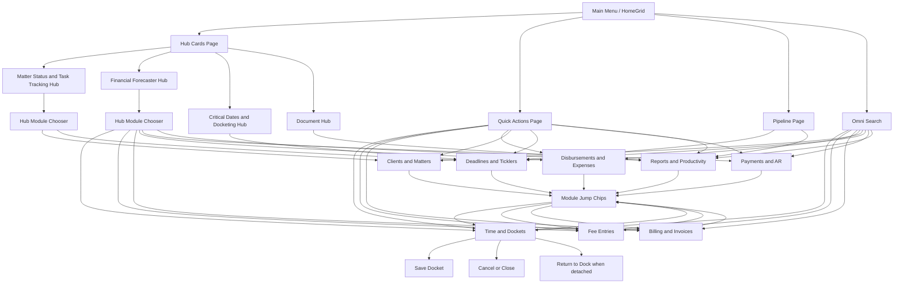

# CSPM Navigation Flowchart Plan

Last updated: 2026-02-22
Owner: Product + Engineering
Status: Active

## Primary flowchart

## Deterministic routing rules

1. Hub cards with one module route directly to that module.
2. Hub cards with multiple modules always open the hub module chooser first.
3. Quick Actions always open modules directly (no chooser).
4. Omni Search command routing resolves to a module and opens it directly.
5. Module jump chips within module views transfer state and then open the selected module.
6. Cancel/Close returns to Main Menu for docked mode and closes detached shells when detached mode is active.

## Direct path to the docket entry form (without search)

1. Main Menu -> Swipe to `Quick Actions` -> `New Docket Entry`.
2. Main Menu -> `Financial Forecaster` hub card -> choose `Time and Dockets` in the chooser.

## Detailed route map

| Surface | Control | Route target |
|---|---|---|
| Main Menu / Page 1 | Matter Status and Task Tracking | Hub chooser (Clients and Matters, Deadlines and Ticklers) |
| Main Menu / Page 1 | Financial Forecaster | Hub chooser (Time and Dockets, Fee Entries, Billing and Invoices, Disbursements and Expenses, Payments and AR, Reports and Productivity) |
| Main Menu / Page 1 | Critical Dates and Docketing | Deadlines and Ticklers |
| Main Menu / Page 1 | Document Hub | Reports and Productivity |
| Main Menu / Page 2 | New Docket Entry | Time and Dockets |
| Main Menu / Page 2 | Capture Fee Entry | Fee Entries |
| Main Menu / Page 2 | Create Invoice | Billing and Invoices |
| Main Menu / Page 2 | Log Expense | Disbursements and Expenses |
| Main Menu / Page 2 | Open Client Matter | Clients and Matters |
| Main Menu / Page 2 | Review Deadlines | Deadlines and Ticklers |
| Main Menu / Page 2 | Post Payment | Payments and AR |
| Main Menu / Page 2 | Open Reports | Reports and Productivity |
| Main Menu / Page 3 | Open Deadlines | Deadlines and Ticklers |
| Main Menu / Page 3 | Open Reports | Reports and Productivity |
| Main Menu | Omni Search submit | Routed module result |
| Time and Dockets | Save Docket | Save payload and remain in module |
| Time and Dockets | Cancel/Close | Return to Main Menu (docked) or close shell (detached) |
| Time and Dockets | Return to Dock | Dock detached panel into parent shell |
| Placeholder modules | Submit | Persist placeholder state and remain in module |
| Placeholder modules | Cancel/Close | Return to Main Menu (docked) or close shell (detached) |
| Placeholder modules | Return to Dock | Dock detached panel into parent shell |
| Time and Dockets / Placeholder | Module jump chips | Jump to selected module, carrying snapshot state |

## Button and tile inventory (high-level)

1. Window chrome: Theme picker, minimize, maximize/restore, close.
2. Top-level: Hub cards, Quick Action buttons, Pipeline buttons, swipe arrows, page indicators, Omni Search enter.
3. Hub chooser modal: module route buttons, cancel.
4. Time and Dockets: Start/Stop timer, Save Docket, Cancel/Close, Return to Dock.
5. Placeholder modules: Submit, Cancel/Close, Return to Dock, module jump chips.
